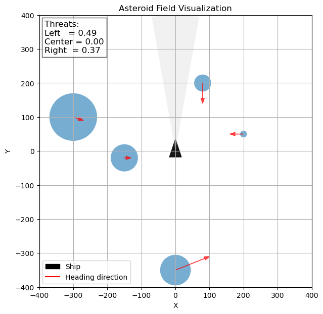
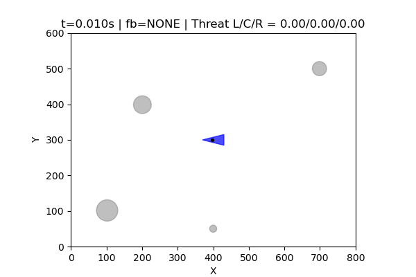

# Asteroid arcade game
This project implements a full closed-loop system where a biological neural network (BNN) or a simulated spiking surrogate controls an asteroid-avoidance game in real time. Threat information is encoded into stimulation frequencies, spike trains are decoded into ship actions, and reward/punishment feedback pulses shape the network’s behavior. The code includes sensory encoding, spike simulation, decoding logic, physics updates, two feedback learning loops, and full step-by-step visualization with video export.

